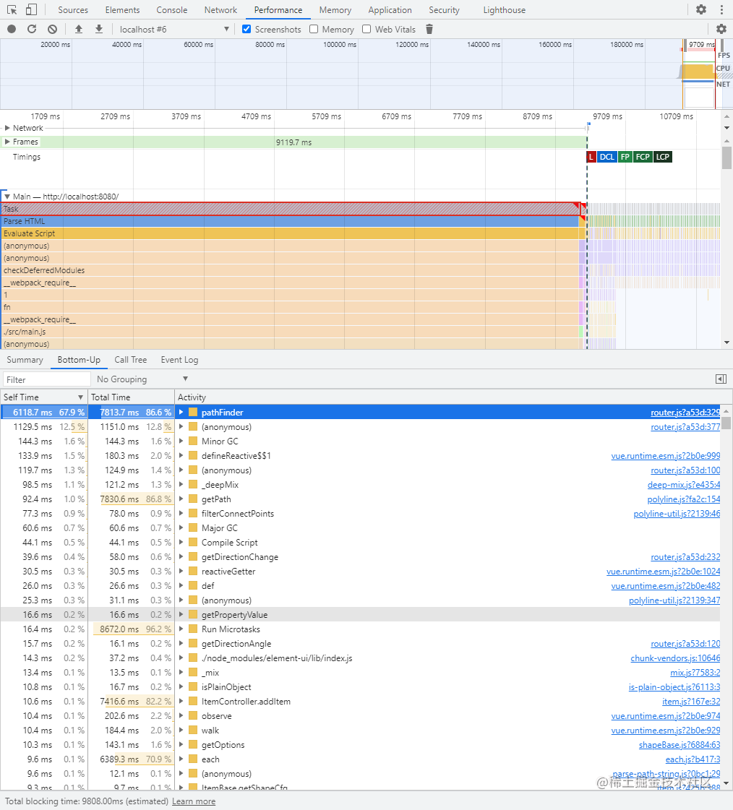
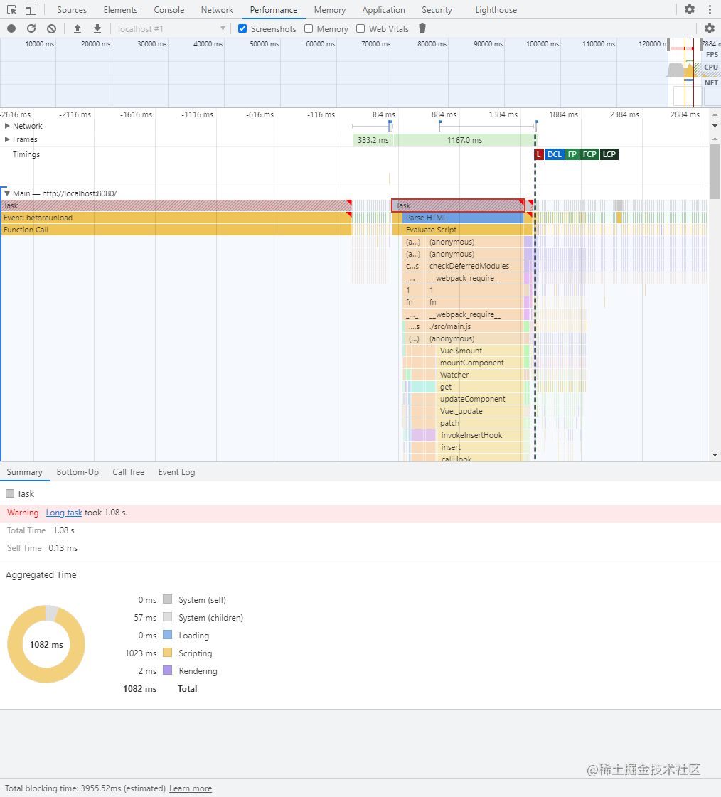
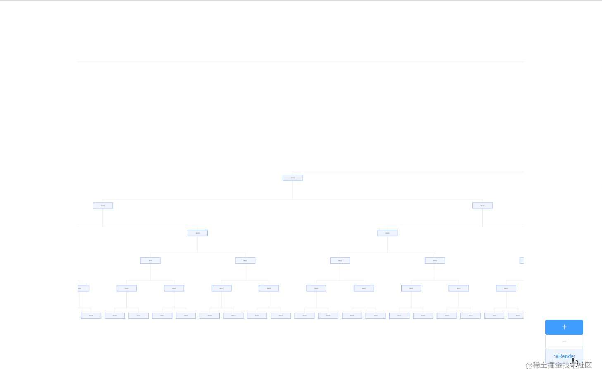
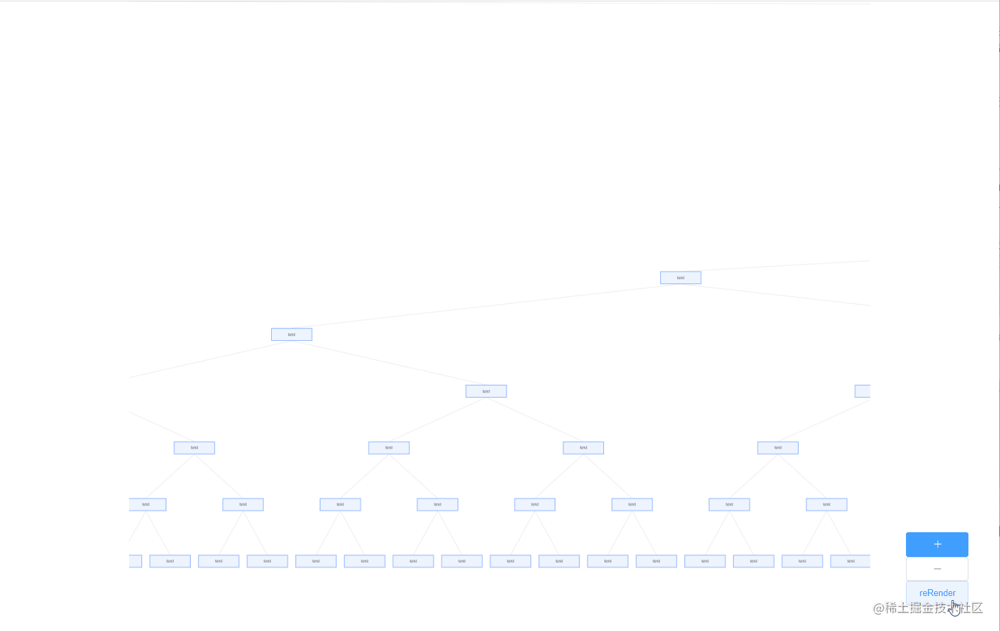
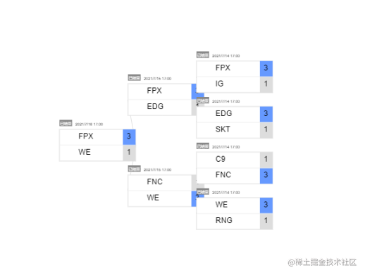
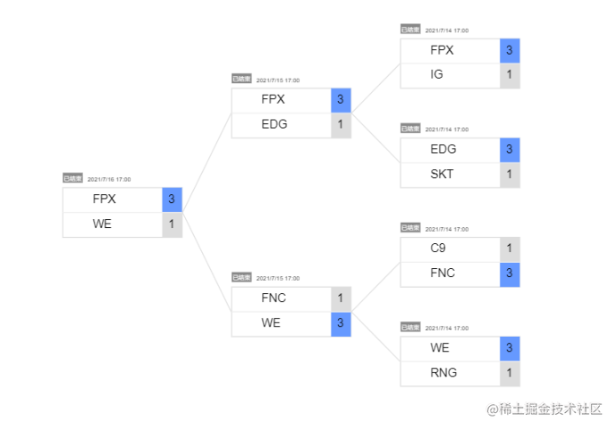

# Antv G6的踩坑记录

## 1. 前言
前几天刚写下了一篇关于介绍G6的博客，有兴趣的可以看一下。后面回想起来发现当时把篇幅都花在介绍G6的核心概念上面了，真正实战和后面问题部分的总结还不够完善。因此再写一篇博客来补充一下。

## 2. 实现上的一些坑
正如前篇提到的，在实现的时候遇到一些关于渲染性能和布局方面的问题。那就一步步来先从性能方面介绍吧。

### 2.1. 性能问题
#### 2.1.1. 首屏渲染
由于需求涉及大量数据的渲染，刚开始做demo的时候模拟了1000+的数据，测试一下G6树图布局的渲染性能。初版的demo写好之后发现渲染效果挺差的，启动的时候居然有9秒的白屏时间。而在官方提供的一个性能demo，节点数量50000+的情况下才出现交互上的卡顿，而且首屏的渲染加上网络的请求时间加起来也不过8s左右。于是打开了Performance找一下问题出在哪个地方。

    



从上面的性能截图发现，pathFinder这个方法耗时了6s多。重复调试发现这个函数平均耗时都在6到7s。那我们的优化就要从这个函数入手了。这是Antv G6/edge包下的一个函数，说明我们的耗时跟树图的边有关系。后面查阅github上的issue和官方文档找到了答案，当我们的边类型设置为polyline时，默认会根据 A* 算法自动生成折线，而这个算法的时间复杂的挺高的。我们尝试着切换一下edge的type看一下效果。整体的耗时在1s左右。



我们通过两张gif更直观地感受一下优化的效果。

优化前：



优化后：





不过当我们确实需要折线的样式又不想使用性能消耗比较大的polyline时，可以采用自定义edge的方式生成折线的样式， 这种方式的渲染表现基本与内置边一致。这里简略贴下自定义折线的核心代码。
```js
G6.registerEdge(
        "h-poly-line",
        {
          draw(cfg, group) {
            const { startPoint, endPoint } = cfg;
            const shape = group.addShape("path", {
              attrs: {
                stroke: "#333",
                path: [
                  ["M", startPoint.x, startPoint.y],
                  ["L", endPoint.x / 3 + (2 / 3) * startPoint.x, startPoint.y], // 三分之一处
                  ["L", endPoint.x / 3 + (2 / 3) * startPoint.x, endPoint.y], // 三分之二处
                  ["L", endPoint.x, endPoint.y],
                ],
              },
              name: "h-poly-line",
            });
            return shape;
          },
          update: undefined //这里需要重写update不然默认继承line的方法
        },
        "line"
      );
```
使用的时候只需要在实例化Graph的配置中指定edge的type即可。
```js
const graph = new G6.Graph({
      ...
      defaultEdge: {
        type: 'h-poly-line' //指定边的类型
      }
      ...
    })
```
官方还提供了另外一种优化渲染的方案，就是通过 Web-Worker 机制去渲染，而不阻塞页面的其他部分用户交互。使用上也很简单同样是在config中配置即可。

#### 2.1.2. 交互性能
同样是数据量1000+的情况，我们的demo在拖拽和缩放的交互上面会出现卡顿。前面提到了官方的性能例子并没有出现这个问题，主要是因为官方的例子中使用了内置的节点，由于要满足展示更多比赛信息的需求，demo则是使用了自定义的节点。这导致了我们在交互的时候要花更多的时间去重新渲染整个节点。官方给这方面的情况提供了一个优化的方法, 代码如下。在节点交互的时候，不渲染除keyShape外的Shape。虽然带来更好的性能，但是开启这个功能后用户的视觉体验是会比较差的。所以使用这个方案还要考虑清楚。
```js
const graph = new G6.Graph({
      ...
       modes: {
          default: [
            "drag-canvas",
            {
              type: "zoom-canvas",
              enableOptimize: true //开启性能优化
            }
          ],
        },
      ...
    })
```
另外就是从node入手优化了，减少节点中不必要的Shape，这个要根据实际情况分析，这里就不展开了。

### 2.2. 布局问题
另一个比较难处理的问题就是布局问题，内置的树图布局并不能计算出节点准确的坐标，导致节点重叠在一起。下面是采用默认参数下的紧凑树图布局效果。



目前是通过主动去设定间隔和节点宽高去调整布局,但个人感觉这种方法不是特别的优雅。配置的代码如下：
```js
const graph = new G6.Graph({
      ...
      layout: {
          type: "compactBox",
          direction: direction,
         //下面四个属性配置布局中的节点宽高和层级间隔
         //官方文档中这几个属性的function|number
         //不过在4.3.4版本下使用number会报错
         //参数为节点信息
          getWidth: ({type, size}) => {
            if(type === "race-node"){
              return size[0]
            }
            return 200
          },
          getHeight: ({type, size}) => {
            if(type === "race-node"){
              return size[1]
            }
            return 100
          },
          getHGap: ({type}) => type === 'race-node'? 25 : 10,
          getVGap: ({type}) => type === 'race-node'? 25 : 100
        }
      ...
    })
```
修改配置后的效果如下：

    



## 3. 使用上的一些坑
翻阅文档和实现过程中发现，树图布局还是有比较多的限制。树图布局并不支持放在子图布局中，也不支持Web-Worker优化。由于它跟一般图的数据结构不一致，两者不能在画板上混用。另外树图布局中也不能使用Combo(即将多个节点归为一组)。根据官方的说法，上面这几个功能在短时间内也不打算支持。在某些情况我们可能需要操作树图中某一层级的数据，由于没有Combo这就很难实现了，我们只能用其他的布局去模拟树图，比如说用Darge布局去实现。
Darge布局不像树图一样可以根据数据结构生成节点关系这一点需要另外生成，其它的用法两者都比较类似，性能表现方面也比较相近，Darge布局基本上可以还原一般的树图布局。
```js
// 紧凑树布局 规定的数据类型
const compactBoxData = [
    {
        id: '1',
        children: [
            {
                id: '2',
                children: []
            }
            ...
        ]
    }
]
// 加载数据
graph.data(compactBoxData)

//Darge布局
//需要将元数据转换成下列形式
const dargeData = {
    nodes: [
        {
            id: '1'
        },
        {
            id: '2'
        }
        ...
    ],
    edges: [
        {
            source: '1',
            target: '2'
        }
    ]
}

// 加载数据
graph.data(dargeData)
```
完整的代码实现可以看官方的demo。
另外还要吐槽一下，类JSX语法定义节点的方式使用体验上不如原来的addShapeAPI，并不能很好的描述Shape间的关系，嵌套层级过深的话会出现重叠等布局bug。

## 4. 总结
以上就是目前遇到的一些坑。虽然有些小的问题，但在社区主流可视化方案中，G6更加适合图可视化的场景，开箱即用同时又有较好的扩展性，提供的布局和交互能力基本可以覆盖常见的业务需求。需要快速开发的情况下G6确实是个不错的选择。

