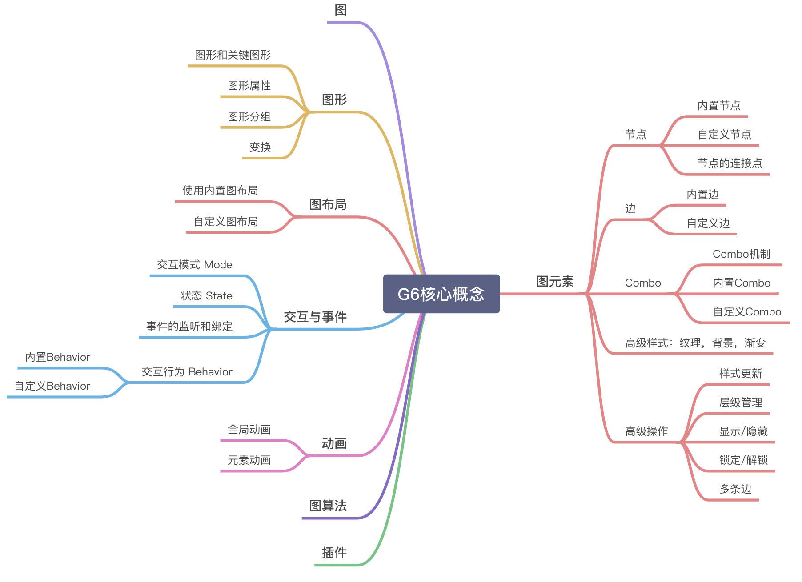

# 在Vue中使用Antv G6

## 1. 前言
笔者最近在做一些可视化方面的任务，具体的需求就是要在页面上绘制出树状的关系图。在参考并且对比了社区的主流方案后，最后选择了Antv G6。在使用的过程也遇到了一些问题，就想写篇博客记录一下。

## 2. 介绍
Antv G6是蚂蚁数据可视化团队开源的一个图可视化引擎。它在高定制能力的基础上，提供了一系列设计优雅、便于使用的图可视化解决方案。能帮助开发者搭建属于自己的图可视化、图分析、或图编辑器应用。

## 3. 搭建
项目使用Vue-cli搭建,仍然使用Vue2.x的版本。搭建时的配置按照实际的需求来即可，这边我们选择默认的配置。具体配置可以看vue-cli这里不展开了。然后是下载Antv g6,最后在需要使用的文件引入即可。
```shell
#step1: 创建项目
vue create antv-demo

#step2: 在项目目录中，使用如下命令下载Antv g6
npm install --save @antv/g6

#step3: 引入Antv g6
import G6 from '@antv/g6';
```
## 4. 核心概念
在正式使用之前，我们先来了解一下Antv G6中的一些核心概念。下面这个是官方提供的思维导图。由于有些功能笔者也没有深入的使用，故这里不做介绍，大家可以在官网中查阅。



### 4.1 Graph
在G6中，Graph对象可以说是图的载体，它包含图的所有元素，并且挂载了图的各种操作。Graph也有生命周期这一概念，初始化 —> 加载数据 —> 渲染 —> 更新 —> 销毁。要想实现图的可视化，我们的第一步就是实例化一个Graph对象。
```js
//实例化Graph
const graph = new G6.Graph({
    container: "", // 指定图画布的容器，可以直接传容器的id也可以传一个DOM 对象
    width: 800,// 画布宽高
    height: 800
})
```
执行上面这段代码后，返回一个Graph对象，我们后续的各种操作都需要通过它进行。另外上面这些只是初始化时的必要配置项，更多的配置请在官网查阅。

### 4.2 图元素
图元素包括节点（Node）、边（Edge）、Combo（类似于Node Group）这三类。每个图元素都可以由多个Shape组成，但是他们都只能由一个KeyShape。这里提到的Shape其实就是简单的图形，比如说矩形，圆形，文本等等。G6中内置了很多节点，边和Combo，此外G6还提供了自定义的能力，通过自己搭配和组合 shape 进行节点/边/ Combo 的自定义。图元素具有很多公共的通用属性和通用方法，而且不同的图元素还有特殊的一些属性、方法。

### 4.3 图布局
我们的图元素需要以怎样的布局展示在画板上。G6内置多种的布局算法，可以计算出每个图元素的坐标信息。布局的算法仅仅是计算出元素的x、y，不处理渲染的任务，因此我们也可以引用外部的算法计算坐标，再让G6渲染。

### 4.4 交互与事件
G6提供比较丰富的交互能力，这里涉及几个比较重要的概念我们分开介绍。

#### 4.4.1 Behavior
Behavior是G6提供的定义图上交互事件的机制，比如说拖拽，缩放等，这些都是内置的Behavior，此外我们还可以注册自定义Behavior。使用它的时候要于交互模式一起使用。

#### 4.4.2 交互模式 Mode
我们可以通过设置mode去管理Behavior。至于为什么会出现这个概念，我们可以想象一个场景，当用户选择了编辑模式是需要拖拽节点的，而只读模式则不需要这个交互。所以G6提供了这样的一种机制去管理。默认就是default模式。

#### 4.4.3 状态 State
G6 中的 state，指的是节点或边的状态。经常会出现触发某种事件/交互后要改变某种状态这样的场景。我们就可以通过设置State实现，另外我们也可以给不同的State配置样式。

#### 4.4.4 监听和绑定事件
除了上述的事件管理能力外，我们还可以直接对某个事件或者时机的监听。在G6中事件可以被分成以下几类：

画布、图形层次的事件，mousedown，mouseup，click，mouseenter，mouseleave 等；

节点/边 上的事件，node:mousedown，edge:click 等，以 type:eventName 为事件名称；

时机事件：

节点/边增删改时的事件, 例如：beforeadditem，afteradditem 等；
节点/边状态改变时的事件：beforerefreshitem 与 afterrefreshitem；
布局时机：beforelayout 与 afterlayout。
上面就是基本的一些概念，接下来我们开始实战的环节。

## 5.使用
这里我们实现一个简单的demo,用darge布局实现一个树状的结构，这里简单封装了一个GraphVisual的类去实现graph的初始化和渲染。至于为什么不采用TreeGraph，这个会在下一节提到。

### 5.1 实例化Graph
通过传入的参数实例化Graph,除了一些必要的配置外，我们还定义了节点和边的样式，指定了图的布局算法，还有交互方式。
```js
initGraph(){
    const container = this.container
    const {width, height, direction} = this.config
    const graph = new G6.Graph({
      container,
      width,
      height,
      modes: {
        default: ['drag-canvas', 'zoom-canvas'] //指定默认模式下的交互方式
      },
      defaultEdge: {
        type: 'line' //指定边的类型
      },
      defaultNode: {
        type: 'rect',
        size: [60, 30],
        //指定边链接的点
        anchorPoints: [[0.5, 0], [0.5, 1]]
      },
      //设置图布局算法
      layout: {
        type: 'dagre',
        rankdir: direction,
        ranksep: 20,
        nodesep: 20
      }
    })
    this.graph = graph
 }
```
### 5.2 数据处理和渲染
初始化的图数据，是一个包括 nodes 数组和 edges 数组的对象，我们要将数据转化成这种形式。再通过graph的data方法绑定，最后调用graph的render方法将元素渲染到画板上。
```js
const data = {
  nodes: [
    {
      id: 'node1',
      label: 'node1',
    },
    {
      id: 'node2',
      label: 'node2',
    },
  ],
  edges: [
    {
      source: 'node1',
      target: 'node2',
    },
  ],
}

this.graph.data(data)
this.graph.render()
```
### 5.3 在Vue中使用
通过ref获得dom对象，并将data一起传入到GraphVisual中。最后我们预览一下运行的结果。
```vue
<template>
  <div id="app" ref="container"/>
</template>

<script>
import {treeData} from './data'
import {GraphVisual} from './utils/MatchVisual'
export default {
  name: 'App',
  components: {},
  data() {
    return {
      treeData
    }
  },
  mounted(){
    new GraphVisual(this.$refs.container, this.treeData)
  }
}
</script>
```

由于Antv G6的api比较多，可以实现的图种类也很丰富。这里笔者就不详细去用demo实现介绍了，感兴趣的可以查看官网上的样例。

## 6. 之前使用遇到的问题
### 6.1 性能问题
笔者之前在做将1000+的节点数据渲染成树图结构的时候，首屏渲染耗时去到6，7秒。刚开始的时候没有搞清楚问题出在哪里。官方提供的一个性能demo，在节点数量50000+的情况下才出现，交互上的卡顿，而且首屏的加载也不过8s左右。后来在github的issue上找到了答案，实现的时候edge使用的是polyline类型，由于polyline 自动巡径算法复杂度很高，导致了渲染性能的问题。后面采用了自定义实现polyline的方式，现在的渲染速度已经在1s内了。

### 6.2 布局问题
同样是在做树图布局的时候遇到的问题。在数据的层级比较多的情况下，最后一层的节点总是会重叠在一起。按照官方的一些布局配置也没有解决。最后用了一个比较粗暴的办法，直接设定节点的占位宽度。可能有更好的解决办法不过我暂时还没有找到。

### 6.3 TreeGraph
树图布局提供了很强大的能力，基本可以满足树图的需求。不过目前TreeGraph还不可以搭配combo去使用，在前一节我们也提到了为什么不使用TreeGraph，就是出于这个原因考虑的。参考了一些布局demo后决定改用dagre, 基本可以还原TreeGraph。


