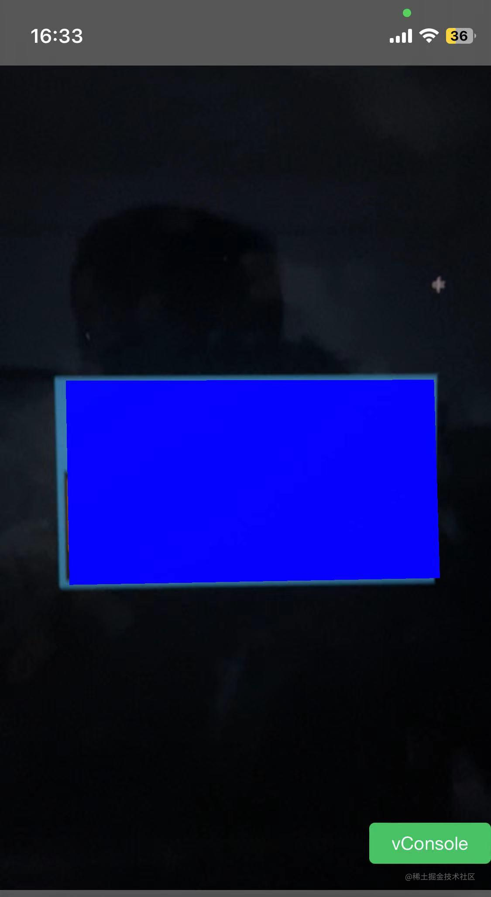

# MindAR.js搭建一个webAR应用

最近刚好在调研webAR方面的技术，发现了Mind-ar.js这个库，可以比较方便地实现图像追踪和人脸追踪的ar效果。在接下来的文章中，我将介绍 MindAR.js 的一些基本概念和使用方法。
## 概述
[MindAR](https://github.com/hiukim/mind-ar-js)是一个开源的webAR库，主要提供了图像追踪（image tracking）和 人脸追踪（face tracking）的能力，图像追踪参考[artoolkit](https://github.com/artoolkitx/artoolkit5)实现，人脸追踪依赖[mediapipe face mesh model](https://developers.google.com/mediapipe/solutions/vision/face_landmarker/)实现。

MindAR有以下优势:
- 较稳定 image tracking 和 face tracking的识别的效果稳定
- 高性能 利用GPU(webgl)和web worker提升性能
- 易用 开发者可以利用A-Frame简单且快速搭建一个WebAR应用

## 使用
虽然MindAR同时支持A-Frame和Threejs实现, 由于是入门这里就选用较为简单的A-Frame来实现demo，并且A-Frame也是该库最先支持的，官方的demo里相关的案例也会更多一些。
### A-Frame
先简单介绍下A-Frame，A-Frame是一个构建VR应用的web框架，提供一种标记语言的方式构建3D场景。demo里的A-Frame比较基础，在用到的时候会说明下, 所以我们不会深入A-Frame，感兴趣的朋友可以查阅[文档](https://aframe.io/)。

### Image Tracking
要实现image tracking，首先要对识别的图片进行预处理，识别图片中的特征点。这一步可以通过官方的提供的[工具](https://hiukim.github.io/mind-ar-js-doc/tools/compile/)进行。

我们直接用官方提供的示例图片进行处理，处理完成后，我们能够可视化看到图片的特征点，如下图。另外，如果我们需要识别多个图片，可以上传多个图片同时处理，不过需要注意**图片的顺序**后续会在Mult-Tracking的时候用到。点击下载生成一个.mind后缀的文件，包含了所有图片特征点的信息，下一步我们就开始构建页面了。


#### 简单的示例
新建一个html文件，接下来我们在head中通过cdn引入相关库的代码。 注意这里和官方demo中用到的1.2.1不同，我在写demo的时候引入这个版本的库失败了，所以调整了一下。
```html
<script src="https://cdn.jsdelivr.net/gh/hiukim/mind-ar-js@1.1.4/dist/mindar-image.prod.js"></script>
<script src="https://aframe.io/releases/1.2.0/aframe.min.js"></script>
<script src="https://cdn.jsdelivr.net/gh/hiukim/mind-ar-js@1.1.4/dist/mindar-image-aframe.prod.js"></script>
<!-- 方便在移动端调试 -->
<script src="https://unpkg.com/vconsole@latest/dist/vconsole.min.js"></script>
```
接下来，在body标签中添加场景和相机。

通过a-scene标签添加场景，a-scene帮助我们配置好渲染3D效果所需的东西。后续所有的实体，比如相机，3D模型等，都放在a-scene标签下。vr-mode-ui和device-orientation-permission-ui这两个属性是禁用a-frame vr的默认行为。我们重点关注**mindar-image**，这里通过一个路径指向刚刚预处理生成的.mind。

然后我们设置一个相机，以便观察渲染的3D效果，position和look-controls两个属性也是跟下面一致即可。
```html
<a-scene mindar-image="imageTargetSrc: ./targets.mind;" vr-mode-ui="enabled: false" device-orientation-permission-ui="enabled: false">  
    <a-camera position="0 0 0" look-controls="enabled: false"></a-camera>
</a-scene>
```
之后，我们需要定义识别成功后渲染什么效果，在scene下添加一个a-entity标签，并且设置**mindar-image-target="targetIndex: 0"**，告诉MindAR与哪张图进行关联，targetIndex是从0开始的，**targetIndex与生成.Mind时图片的顺序是一致**。

a-plane就是识别成功后渲染到场景中的3D物体，这里是一个plane，你也可以切换成box或者其他。

PS: width设置为1，表示物体的宽度与图片的宽度一致，另外height和depth参数的参数是相对于width的，这里可以调试一下属性的值看下效果。
```html
<a-entity mindar-image-target="targetIndex: 0">  
    <a-plane color="blue" opaciy="0.5" position="0 0 0" height="0.552" width="1" rotation="0 0 0"></a-plane>  
</a-entity>
```
到这一步我们就开发完成了，想要看实现的效果我们可以通过http-server或者vite等工具，开启https服务在本地查看，需要你的设备有摄像头。或者通过github page，vercel等工具快速搭建一个静态服务的网站，在移动端打开查看。这里不过多介绍，手机打开网页就可以看到效果了。

PS:  由于浏览器策略，这里必须要开启https才能拉起摄像头


<p align=center></p>

#### 识别多个图片
在上面demo的基础上，支持识别多个图片的效果。因为更新了识别的图片，我们需要重新生成.mind文件。
接着调整一下原有的代码，增加一个a-entity, 并设置targetIndex为1即与第二张图进行关联。
```html
<a-entity mindar-image-target="targetIndex: 1">
  <!-- 修改plane的颜色区分 -->
  <a-plane color="red" opaciy="0.5" position="0 0 0" height="0.552" width="1" rotation="0 0 0"></a-plane>  
</a-entity>
```
如果需要支持同时识别追踪效果，可以在a-scene下的mindar-image属性设置参数maxTrack。
PS: 需要注意同时识别多张图片可能会对性能造成一定影响
```html
<a-scene mindar-image="imageTargetSrc: ./targets.mind; maxTrack: 2">
</a-scene>
```

#### 添加一个模型资源
接着让我们更新下第二个图片识别后的效果，展示一个3D模型。需要加载的外部资源，比如图片，模型，视频等都需要放在a-assets这个标签下面。

下面这段代码定义了一个模型资源，只需要设置id和src即可。
```html
 <a-assets>
   <a-asset-item id="model" src="./assets/Soldier.glb"></a-asset-item>
 </a-assets>
```
使用这个模型资源，我们只需要定义一个a-entity标签，并将gltf-model设置为资源的id即可。位置，缩放及旋转属性，根据模型和具体展示的效果调整即可。

**animation-mixer**这个属性为A-Frame的扩展功能，如果需要展示模型的动画效果，可以在head中增加引用https://cdn.jsdelivr.net/gh/donmccurdy/aframe-extras@v6.1.1/dist/aframe-extras.min.js, 关于这个属性的用法可以看[这里](https://github.com/c-frame/aframe-extras/tree/master/src/loaders#animation)

```html
<a-entity mindar-image-target="targetIndex: 1">
        <a-entity gltf-model="#model" rotation="0 180 0" scale="1 1 1" position="0 -0.5 0" animation-mixer="clip: Run"></a-entity>
</a-entity>
```

实现效果如下: 

<p align=center></p>

PS: 模型如果出现色值过暗等情况，可以考虑在a-scene设置下面属性,具体原理可以看下这个
[issue](https://github.com/aframevr/aframe/issues/3509)
    
    color-space="sRGB" renderer="colorManagement: true, physicallyCorrectLights: true"

#### 抖动问题优化
抖动在AR中是一个常见的问题，它可能由相机输入的噪声或者计算错误导致。MindAR通过增加filter(不太确定如何翻译)，简单来说就是根据多个帧取平均，已得到更精确的定位。 但是这种平滑处理因为依赖前面几帧的结果，导致渲染的内容可能不在最新的位置。这个现象在镜头快速移动的情况下更加明显。

MindAR暴露两个参数允许用户调整平滑效果分别是**filterMinCF**和**filterBeta**，降低的值前者可以减少抖动，增加后者可以减少延迟。下面的参数是社区推荐的设置，可以作为参考，但还是要根据实际的应用场景进行调整。

    <a-scene mindar-image="filterMinCF:.001; filterBeta: 1"/>

### Face Tracking
#### 简单的示例
首先还是新建html文件，并引入相应的库
```html
<!-- 与Image Tracking引入的库有不同 -->
<script src="https://cdn.jsdelivr.net/gh/hiukim/mind-ar-js@1.1.4/dist/mindar-face.prod.js"></script>
<script src="https://aframe.io/releases/1.2.0/aframe.min.js"></script>
<script src="https://cdn.jsdelivr.net/gh/hiukim/mind-ar-js@1.1.4/dist/mindar-face-aframe.prod.js"></script>
```
修改a-scene和a-camera对应的参数，调整为face mode
```
<a-scene mindar-face embedded color-space="sRGB" renderer="colorManagement: true, physicallyCorrectLights: true" vr-mode-ui="enabled: false" device-orientation-permission-ui="enabled: false">
      <a-camera active="false" position="0 0 0"></a-camera>
</a-scene>
```
与Image tracking一样，同样需要定义一个a-entity，不过这里的属性替换成**mindar-face-target="anchorIndex: 152"**，这个设置告诉MindAR需要识别面部的哪一个点位将物体渲染在该位置。
面部点位的编号可以看[这里](https://github.com/tensorflow/tfjs-models/blob/master/face-landmarks-detection/mesh_map.jpg)。

下面这段代码渲染了一个3D的面具模型在脸部的位置，模型引入上面已经介绍，这里就直接略过。最后实现的效果如下
```
<a-entity mindar-face-target="anchorIndex: 152">
     <a-assets>
       <a-asset-item id="model" src="./assets/skull_mask.glb"></a-asset-item>
     </a-assets>
    <a-entity gltf-model="#model" rotation="0 0 0" scale="0.03 0.03 0.03" position="0 0 0" ></a-entity>
 </a-entity>
```

<p align=center></p>

以上就是MindAR基础的一些demo，限于篇幅原因还有交互、自定义UI等功能和案例没有详细介绍，大家可以前往官方的[文档](https://hiukim.github.io/mind-ar-js-doc/)查阅。

## 其他WebAR方案
介绍完MindAR，想在最后简单补充下目前的实现WebAR的一些方案
### 开源方案
- [AR.js](https://ar-js-org.github.io/AR.js-Docs/) 目前社区使用人数最多的库，支持Image Tracking, Location Based AR（基于位置AR）,Marker Tracking(标记跟踪)。 不过根据测试的结果（设备IOS）,在Image Tracking的表现AR.js不如MindAR, 会出现比较严重的抖动问题，如果需要开发Image Tracking的AR应用可以直接用MindAR了。开发另外两种AR应用还是推荐AR.js。
- [WebXR](https://developers.google.com/ar/develop/webxr?hl=zh-cn) 是一种web技术标准，可以让开发者在浏览器中创建虚拟现实（VR）和增强现实（AR）应用程序，许多3D库的AR依赖WebXR，比如Unity WebAR, BabylonJs。最大的问题是兼容性，目前safari还不支持。不需要考虑兼容性的话，可以直接考虑使用WebXR开发。
- [AlvaAR](https://github.com/alanross/AlvaAR/tree/main) 目前该库还是在起步阶段，支持SLAM，目前我还没有找到其他开源的WebAR SLAM方案，有的话欢迎各位大佬补充。

### 商业方案
顺带列举一下收费的WebAR方案,就不给出详细的介绍了。
- 8th Wall
- awe.js
- vectary
- zapworks
- kivicube

## 写在最后
目前实现WebAR可选的方案还是很多的，大家可以根据实际交互场景进行选择。最后，也希望Safari可以尽快支持WebXR，提供开发者一个统一的WebAR方案。