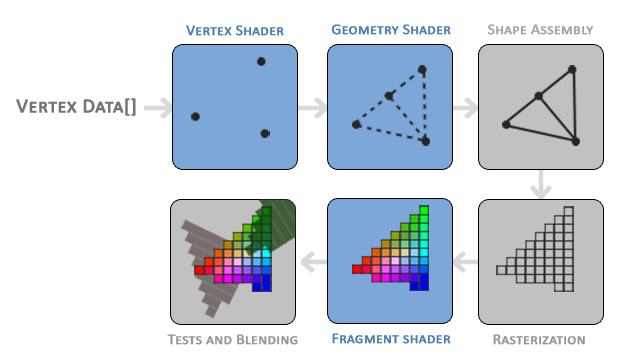
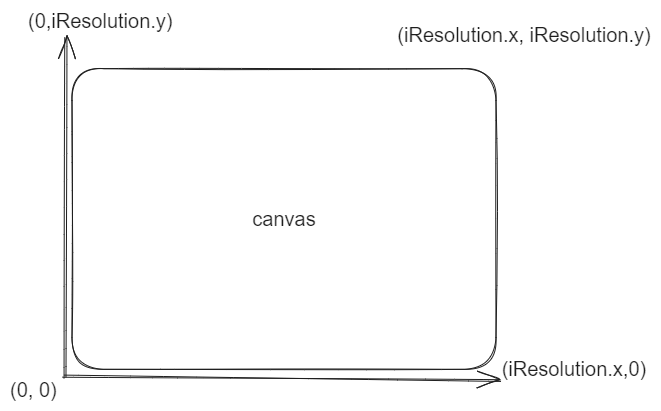

# Shader 入门与实践

## 关于Shader

### 什么是Shader
Shader（着色器）是一种用于在计算机图形学中进行图形渲染的程序。它们是在图形处理单元（GPU）上执行的小型程序，用于控制图形的各个方面，如颜色、光照、纹理映射、投影等。

在图形渲染过程中，着色器被用于对场景中的几何形状进行处理，并为每个像素或顶点计算出最终的颜色或属性。着色器通常由两种类型组成：顶点着色器和片元着色器。

顶点着色器（Vertex Shader）：顶点着色器对输入的顶点进行处理，计算出每个顶点的最终位置、颜色、法线等属性。它可以进行坐标变换、光照计算、顶点动画等操作。

片元着色器（Fragment Shader）：片元着色器对每个像素进行处理，计算出像素的最终颜色。它可以进行纹理采样、光照计算、阴影计算等操作。片元着色器通常用于生成最终的图像。

着色器使用一种特定的编程语言来描述图形处理的逻辑和计算过程。在现代图形编程中，常用的着色器语言是 OpenGL Shading Language（GLSL）和 DirectX High-Level Shading Language（HLSL）。这些着色器语言提供了丰富的函数和语法，使开发者能够实现各种复杂的图形效果。

### Webgl
WebGL（Web Graphics Library）是一种基于JavaScript API的图形库，用于在Web浏览器中进行硬件加速的3D图形渲染。它是基于OpenGL ES标准的子集，并提供了一套API，使开发者能够使用JavaScript来创建交互式的3D图形应用程序。

WebGL通过GPU来加速图形渲染，可以利用计算机的硬件加速功能，实现高性能的实时渲染。它提供了一组函数和接口，用于创建和管理图形上下文、着色器程序、缓冲区对象、纹理等，以及执行各种图形操作和渲染任务。

### 渲染管线
渲染管线（图形渲染流程）是将三维场景中的图像转换成二维图像的过程。这一过程通常有下面几个步骤:

1. 顶点处理: 顶点着色器读取在顶点缓冲区中的输入数据，这一步主要是将输入的顶点进行坐标转换。
2. 几何着色器处理: 这一步是可选的，几何着色器将一组顶点作为输入，这些顶点形成图元，并且能够通过发出新的顶点来形成新的(或其他)图元来生成其他形状。
3. 图元装配与裁剪: 图元装配是从先前阶段输出的顶点数据中收集并将其组合成一系列图元的过程。用户渲染使用的图元类型决定了这个过程的工作方式。
该过程的输出是一个有序序列的简单图元（线、点或三角形）。接下来进行图元裁剪，这个阶段图元和视口进行相交测试，只有处在视口内的图元会保留，其他则丢弃。

1. 光栅化阶段: 这个阶段会将图元映射成屏幕上的像素，生成下一步片元着色器使用的片元，这之后还会进行一次裁剪操作剔除屏幕外的片元（P.S. 片元不等同于像素，像素是屏幕上的最小可见单位，它代表了屏幕上的一个点。而片元是渲染管线中的一个中间阶段的概念，它表示在光栅化阶段生成的每个图元所覆盖的像素，另外还包含了一些额外的信息，如深度值、法线、纹理坐标等）
2. 片元处理: 通过片元着色器计算一个片元最终的颜色
3. 测试和混合阶段：这一阶段用于控制像素的可见性和颜色混合，这个阶段检测片元的对应的深度和模板(Stencil)值，用它们来判断这个片元是其它物体的前面还是后面，决定是否应该丢弃。这个阶段也会检查alpha值（alpha值定义了一个物体的透明度）并对物体进行混合 

 

<p align=center style="font-size:14px;color:#C0C0C0;text-decoration:underline">图片来源:learnopengl</p>

图形渲染管线的流程虽然很复杂，除了着色器程序外还包含很多配置项，但一般的场景，我们只需要编写顶点和片元着色器就可以满足了。

### ShaderToy
[ShaderToy](https://www.shadertoy.com/)是一个非常出色的工具，它允许用户创建片元着色器并与其他用户分享。类似于前端的Codepen，ShaderToy提供了一个优秀的平台，让你能够熟悉shader语法、学习其他优秀程序员的着色器代码，并快速验证你的着色器程序效果。

需要注意，虽然ShaderToy是基于WebGL API进行渲染的，但它具有一些内置变量和功能，与原生的WebGL有所不同。此外，ShaderToy也不支持顶点着色器，因此在将代码移植到其他平台（如Web,UE,Unity）时，需要进行一定程度的修改和适配。

在本文的后续部分，我们将使用ShaderToy上的代码片段来进行演示和说明。

#### 如何使用ShaderToy
进入网页后，点击上方导航栏的New就进入到code的界面了


## 初识GLSL
GLSL(Graphics Library Shader Language)是一种用于编写着色器程序的编程语言，特别用于在图形处理单元（GPU）上执行图形渲染任务, 有以下几个特点
- 类C的语法风格
- 强类型语言
- 方便向量和矩阵的计算
- 内置的数据结构，包括向量类型（vec2、vec3、vec4）、矩阵类型（mat2、mat3、mat4）等

### 第一个代码片段
当我们在ShaderToy中新建一个Shader会生成下面的代码:
```glsl
void mainImage( out vec4 fragColor, in vec2 fragCoord )
{
    // Normalized pixel coordinates (from 0 to 1)
    vec2 uv = fragCoord/iResolution.xy;

    // Time varying pixel color
    vec3 col = 0.5 + 0.5*cos(iTime+uv.xyx+vec3(0,2,4));

    // Output to screen
    fragColor = vec4(col,1.0);
}
```
上面的代码片段，我们定义了一个mainImage函数，这个函数是我们着色器程序的核心。这个函数接收两个参数fragColor和fragCoord。参数前的in和out表示函数输入和输出。

我们先来看fragCoord这个输入参数。正如前文提到的，ShaderToy内部帮我们实现了顶点着色器，直接给我们提供了输入。fragCoord是一个vec2类型的值，它代表了画布的XY坐标，左下角的值为（0，0）而右上角是 (iResolution.x, iResolution.y)，如下图所示。


通常我们为了方便处理会把坐标归一化成（0,1）或者是（-1,1）
```glsl
vec2 uv = fragCoord/iResolution.xy;
```
接着是输出参数fragColor。fragColor是一个vec4类型的值，代表了片元处理阶段的最终输出颜色，vec4类型包含四个分量（r,g,b,a），分别代表红，绿，蓝还有透明通道（alpha），和CSS颜色常用的Hex Color不同，每个分量的取值范围通常是从0到1，其中0表示最小值（没有颜色或完全透明），1表示最大值（最大亮度或完全不透明）。

我们尝试注释掉原有的颜色变量，重新定义一个
```glsl
//  vec3 col = 0.5 + 0.5*cos(iTime+uv.xyx+vec3(0,2,4));
vec3 col = vec3(0, 0, 0);
```
点击编辑器左下角的编辑按钮或者用快捷键 Alt+Center 、Option+Enter, 就可以看到画布变成黑色了
 

需要注意的是，ShaderToy上的片元着色器代码是与原生的WebGL有所不同（其他平台也是）。但是核心概念是一致的, 输入一个坐标得到一个颜色值, 即

> f(x, y) -> rgba

这里也贴一下WebGL原生的片元着色器代码作为对比。
```glsl
precision mediump float;

void main() {
  vec4 color = vec4(0, 0, 0, 1);
  gl_FragColor = color;
}
```

### GLSL的语法
正如前文提到的，GLSL采用了类似于C语言的语法风格，因此我们不会过多介绍相似的部分。现在让我们重点关注GLSL为我们处理矩阵和矢量提供的语法。

GLSL矢量数据提供了多种分量选择器，这里以vec4 v为例, 其余vec2和vec3同理: 
- v.x 和 v.s 以及 v.r ， v[0] 表达的是同一个分量
- v.y 和 v.t 以及 v.g ， v[1] 表达的是同一个分量
- v.z 和 v.p 以及 v.b ， v[2] 表达的是同一个分量
- v.w 和 v.q 以及 v.a ， v[3] 表达的是同一个分量

另外GLSL还支持Swizzle，它是一种用于重新排列向量分量的操作。比方说:
```glsl
v.yyyy
// 等价于 vec4(v.y, v.y, v.y, v.y)

v.bgra
// 等价于 vec4(v.b, v.g, v.r, v.a)
```

在我们第一个代码片段中也有用到，当构造一个矢量或矩阵时可以一次提供多个分量，例如:
```glsl
vec3 color = vec3(0., 0., 0.);

vec4(col,1.0)
// 等价于 vec4(col.r, col.g, col.b, 1)

vec4(0.)
// 等价于 vec4(0., 0., 0., 0.)
```

此外，在执行矢量和矩阵运算时，GLSL的语法也相当简洁，例如常量和矢量的乘法。
```glsl
vec2 a = vec2(1., 1.);
vec2 b = a * 2.0;
// b 现在是 vec2(2., 2.);
vec2 c = a - 1.
// c 现在是 vec2(0., 0.);
// 加减乘除同理
```
它同样可以做矩阵乘法以及矢量和矩阵的乘法
```glsl
mat4 a = ???
mat4 b = ???
mat4 c = a * b;
 
vec4 v = ???
vec4 y = c * v;
```
更多详细的GLSL语法可以去这里查看[GLSL 规范](https://www.khronos.org/files/opengles_shading_language.pdf)

## hello world
接下来，让我们来编写一个GLSL版本的"Hello World"程序。由于GLSL不能像其他编程语言一样直接输出文本，我们将在画布上绘制一个圆来代替。

或许你会想知道，在ShaderToy中，由于无法编写顶点着色器来处理顶点数据，我们如何绘制一个圆呢？这时就需要介绍一下**有符号距离场（Signed Distance Field）**的概念。SDF是一种用于表示图形形状的数据结构, 它描述了从给定点到最近图形的有向距离。以每个点为中心，计算该点到最近图形表面的距离，并根据点在图形内部还是外部分别赋予正值或负值。SDF可以用来绘制3D或者2D的图形。这里给出了常用2D SDF的示例，感兴趣可以自行查阅[https://iquilezles.org/articles/distfunctions2d/](https://iquilezles.org/articles/distfunctions2d/)

我们都知道圆的一般方程，如下图所示:
 
我们将上述方程改写成下面这种形式，代入点的坐标信息，我们可以很轻松的判断这个点和圆的位置信息，当>0时，表示点在圆外，当<0时，表示在圆内，=0则在圆上。
> y^2 + x^2 - 4

我们就得到了一个绘制圆形的有符号距离场函数,通过glsl写出来。
```glsl
float sdCircle( vec2 p, float r )
{
    // length 可以计算向量的模长，点p相当于从原点出发到点p的向量
    return length(p) - r;
}
```

现在我们编写mainImage函数中的代码，首先是将我们的输入归一化成（-1, 1）。此外我们还需要修复画布的纵横比，当画布的宽度和高度不一致时，归一化得到的uv横向和纵向的单位长度是不同的，渲染出来的图形就会变形。
```glsl
 vec2 uv = 2. * fragCoord/iResolution.xy; // (0,2)
      uv -= 1.;
      uv.x *= iResolution.x/iResolution.y;
```

之后，我们定义将uv传入sdCircle函数中得到距离d, 再根据d的大小输出不同的颜色。

这里我们用到了step函数，它是glsl内置的函数，它接受两个参数第一个是给定的阈值（edge），另外一个是判断的值(x)，当x>=edge时返回1否则返回0。它的图像是这样的:
 

我们以半径为阈值，小于阈值的值返回0, 大于返回1。这样我们就可以渲染一个黑色的圆。

```glsl
float r = 0.1;
float d = sdCircle(uv,  r);
vec3 col = vec3(step(r, d));

fragColor = vec4(col,1.);
```

最后输出的结果如下:
 

现在我们给圆改变一下颜色。一开始我们注释掉的颜色代码。现在我们可以用上了，这是一个颜色变化的动画，这里用到了三角函数**cos** 和 **iTime**(shader代码的运行时间)，由于三角函数的周期性，可以很容易得实现动画效果。
```glsl
vec3 col = 0.5 + 0.5*cos(iTime+uv.xyx+vec3(0,2,4));
```
稍微改写一下前一步的代码，我们就可以得到一个颜色变化得圆
```glsl
float r = 0.1;
vec3 bgCol = vec3(1.);

float d = sdCircle(uv,  r);
float res = step(r, d);

vec3 col = 0.5 + 0.5*cos(iTime+uv.xyx+vec3(0,2,4));
col = (1. -res)* col + res* bgCol;
```
 

完整代码
```glsl
float sdCircle( vec2 p, float r )
{
    return length(p) - r;
}

void mainImage( out vec4 fragColor, in vec2 fragCoord )
{
    vec2 uv =2. * fragCoord/iResolution.xy; 
      uv -= 1.;
      uv.x *= iResolution.x/iResolution.y;
      
    float r = 0.1;
    vec3 bgCol = vec3(1.);

    float d = sdCircle(uv,  r);
    float res = step(r, d);
    
    vec3 col = 0.5 + 0.5*cos(iTime+uv.xyx+vec3(0,2,4));
    col = (1. -res)* col + res* bgCol;

    fragColor = vec4(col,1.);
}
```

## 实践
### 绿幕素材处理

在画布上渲染透明视频或者图片素材是一种常见的场景，一种方案是直接用支持透明通道的格式，另外就是透明化素材中的绿幕背景。

对于绿幕背景的透明化，整体思路是读取素材的颜色数值，并将其与预设的绿幕色数值进行比较。如果颜色数值相近，则将输出的颜色的Alpha通道设为0。

在实际处理的时候，会把原来的RGB颜色编码格式转换成YUV颜色编码格式。[YUV](https://zh.wikipedia.org/wiki/YUV "按住 ⌘ 点击访问 https://zh.wikipedia.org/wiki/YUV") ，是一种常用于影像处理组件的颜色编码格式。其中，Y代表明亮度(luma; brightness)，而U和V分别存储色度(色讯; chrominance; color)部分。转换后，我们只需要对比UV两个通道，这样能够更方便地进行处理。


<p align=center>U-V color plane示例，Y value = 0.5，代表RGB色域</p>

wiki上给出了转换的公式，我们改写成GLSL


```glsl
vec2 RGBtoUV(in vec3 rgb) {
      return vec2(
        rgb.r * -0.169 + rgb.g * -0.331 + rgb.b *  0.5    + 0.5,
        rgb.r *  0.5   + rgb.g * -0.419 + rgb.b * -0.081  + 0.5
      );
    }
```

接下来完成mainImage函数，首先是渲染纹理到画布上，通过编辑器下方的Channel界面增加一个素材，选择Video Tab下的绿幕视频素材。在代码中，我们就能通过iChannel0这个变量去访问。

之后进行纹理的采样，通过texture函数并传入uv坐标从纹理中采样颜色。uv的范围为（0，0）到（1，1），前者表示纹理的左下角，后者则是右上角，如下图所示:


```glsl
void mainImage( out vec4 fragColor, in vec2 fragCoord )
{
  vec2 uv = fragCoord/iResolution.xy; // Normalized pixel coordinates (from 0 to 1)

  vec4 col = texture(iChannel0, uv);

  fragColor = vec4(col); // Output to screen
}
```

下面就是对比色值部份代码，定义了三个宏变量，keyColor是绿幕背景的颜色值，similarity是设定的对比阈值（相似度），smoothness就是平滑的参数。

纹理颜色和keyColor一起传入RGBtoUV转换成YUV格式再通过distance函数计算两个点间的距离。基于相似度（similarity）计算基本遮罩（baseMask）。如果色度距离小于相似度，则基本遮罩为负值，否则为正值。然后，通过将 baseMask 除以平滑度（smoothness）并将结果限制在 0 到 1 的范围内，我们得到一个归一化的值，找进行一次幂运算，这样做是为了控制遮罩的强度。

```glsl
#define keyColor vec3(0., 1., 0.)
#define similarity .4
#define smoothness .08

// ...
float d = distance(RGBtoUV(col.rgb), RGBtoUV(keyColor));
float baseMask = d - similarity;
float fullMask = pow(clamp(baseMask / smoothness, 0., 1.), 1.5);
col.a = fullMask;
//...
```
P.S. 由于ShaderToy中设置透明通道是没有效果的，可以尝试直接输出fullMask


仔细看可以发现边缘部份的一些区域是没有处理到的。为了解决这个问题，我们可以通过将仅包含亮度信息的[灰度值](https://zh.wikipedia.org/wiki/%25E7%259B%25B8%25E5%25AF%25B9%25E5%2585%2589%25E4%25BA%25AE%25E5%25BA%25A6 "按住 ⌘ 点击访问 https://zh.wikipedia.org/wiki/%25E7%259B%25B8%25E5%25AF%25B9%25E5%2585%2589%25E4%25BA%25AE%25E5%25BA%25A6")与输出的RGB值进行混合来修复。混合的插值参数可以通过使用baseMask和spill宏参数进行计算。下面是相关的代码:

```glsl
#define spill .2
#define luminance vec3(0.2125, 0.7154, 0.0721)

//...
float spillVal = pow(clamp(baseMask / spill, 0., 1.), 1.5);
float desat = clamp(dot(col.rgb, luminance), 0., 1.);
col.rgb = mix(vec3(desat), col.rgb, spillVal);
//...
```

最后效果如图示:


P.S. 实际使用中，上面几个宏变量（除了luminance）可以修改成uniform传入，方便调整以适配不同的素材

完整代码

```glsl
#define keyColor vec3(0., 1., 0.)
#define similarity .4
#define smoothness .08
#define spill .2
#define luminance vec3(0.2125, 0.7154, 0.0721)

vec2 RGBtoUV(in vec3 rgb) {
      return vec2(
        rgb.r * -0.169 + rgb.g * -0.331 + rgb.b *  0.5    + 0.5,
        rgb.r *  0.5   + rgb.g * -0.419 + rgb.b * -0.081  + 0.5
      );
}

void mainImage( out vec4 fragColor, in vec2 fragCoord )
{
    vec2 uv = fragCoord/iResolution.xy;

    vec4 col = texture(iChannel0, uv);
    
    float d = distance(RGBtoUV(col.rgb), RGBtoUV(keyColor));
    
    float baseMask = d - similarity;
    float fullMask = pow(clamp(baseMask / smoothness, 0., 1.), 1.5);
    col.a = fullMask;
    
    float spillVal = pow(clamp(baseMask / spill, 0., 1.), 1.5);
    float desat = clamp(dot(col.rgb, luminance), 0., 1.);
    col.rgb = mix(vec3(desat), col.rgb, spillVal);
   
    fragColor = col;
    
}
```

### 更多例子...

to be continued

## 相关资源
https://www.shadertoy.com/

https://learnopengl.com/Introduction

https://www.desmos.com/calculator

https://thebookofshaders.com/

https://iquilezles.org/
