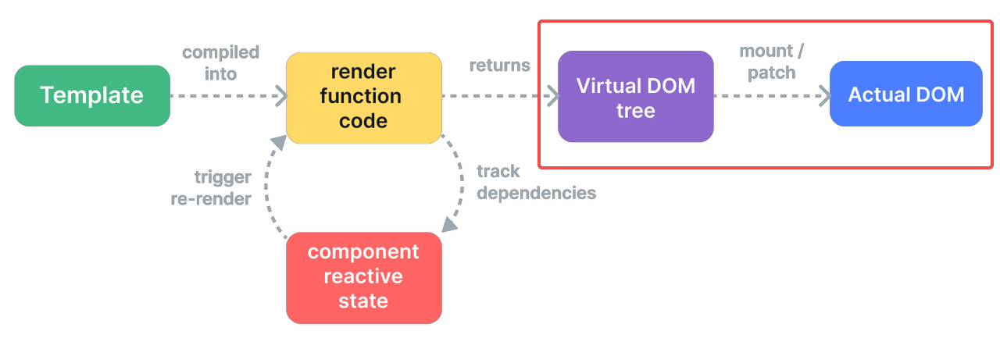

# 1. 什么是渲染器
渲染器是Vue中负责执行渲染工作的组件，它的核心功能是将虚拟DOM（Virtual DOM）转换为特定平台的实际元素。

## 1.1 渲染器核心概念
### 1.1.1 虚拟DOM
虚拟DOM是一种用JavaScript对象描述DOM结构的抽象表示。虚拟DOM具有以下优势
1. 性能优化：通过批量更新和智能Diff算法，减少直接操作DOM的次数，比起传统直接获取dom插入节点性能更好
2. 跨平台能力：同一虚拟节点树可以在不同平台以不同方式渲染
```js
// 虚拟DOM节点的基本结构
const vnode = {
  type: 'div',           // 节点类型
  props: {               // 属性
    id: 'app',
    class: 'container'
  },
  children: [            // 子节点
    { type: 'p', children: 'Hello Vue' },
    { type: 'p', children: 'Virtual DOM' }
  ],
  el: null,              // 对应的真实DOM元素
  key: null,             // 优化用的key
  // ... 其他内部属性
}
```
### 1.1.2 渲染器核心任务
基于虚拟 DOM，渲染器的核心任务可以概括为两大类：
- 挂载（mount）：把虚拟 DOM 渲染成真实 DOM，并挂载到容器中。
- 更新（patch）：当虚拟 DOM 发生变化时，只对差异部分更新真实 DOM，这个过程叫做“打补丁（patch）”。
可以简单理解为：第一次渲染做“挂载”，后续渲染做“打补丁”。
# 2. 渲染器API设计
初始化渲染器需要调用createRender函数创建，接受一个renderOptions的参数, 返回一个包括render，hydrate，createApp能力的渲染器对象。
```ts
// packages/runtime-core/src/renderer.ts
export function createRenderer<
  HostNode = RendererNode,
  HostElement = RendererElement,
>(options: RendererOptions<HostNode, HostElement>): Renderer<HostElement> {
  return baseCreateRenderer<HostNode, HostElement>(options)
}

function baseCreateRenderer(
  options: RendererOptions,
  // renderer需要hydrate能力,通过额外传入api实现
  createHydrationFns?: typeof createHydrationFunctions,
): any {
    const {
        insert: hostInsert,
        remove: hostRemove,
        patchProp: hostPatchProp,
        createElement: hostCreateElement,
        createText: hostCreateText,
        createComment: hostCreateComment,
        setText: hostSetText,
        setElementText: hostSetElementText,
        parentNode: hostParentNode,
        nextSibling: hostNextSibling,
        setScopeId: hostSetScopeId = NOOP,
        insertStaticContent: hostInsertStaticContent,
      } = options
    // 省略代码
    const render = (vnode, container, namespace) => {
        if (vnode == null) {
            if (container._vnode) {
                // 旧vnode存在，且新vnode不存在，说明需要卸载
                // 清空container中的DOM
                unmount(container._vnode, null, null, true)
            }
        } else {
            // 新vnode存在, 将旧vnode一起传给patch函数，进行打补丁
            // 这里实现上将挂载也看作是一次特殊的补丁操作
            patch(
                // 第一个参数n1, 代表旧的Vnode节点
                container._vnode || null,
                // 第二个参数n2, 代表新的Vnode节点
                vnode,
                // 第三个参数container: 挂载节点的容器
                container,
                null,
                null,
                null,
                namespace,
            )
        }
        // 将当前vnode存储在container._vnode下，作为后续渲染的旧vnode
        container._vnode = vnode;
        //...
    };

    return {
        render,
        hydrate,
        internals,
        createApp: createAppAPI(
          mountApp,
          unmountApp,
          getComponentPublicInstance as any,
          render,
        ),
    };
}
```
Vue通过将平台特定的渲染逻辑抽象为统一的渲染配置接口renderOptions。渲染器仅依赖抽象的渲染接口进行工作，无需感知底层是浏览器DOM还是其他渲染目标，从而实现了同一套虚拟节点系统在不同渲染环境下的无缝适配。源码中renderOptions的类型定义如下：
```ts
// packages/runtime-core/src/renderer.ts
export interface RendererOptions<
  HostNode = RendererNode,
  HostElement = RendererElement,
> {
  patchProp(
    el: HostElement,
    key: string,
    prevValue: any,
    nextValue: any,
    namespace?: ElementNamespace,
    parentComponent?: ComponentInternalInstance | null,
  ): void
  insert(el: HostNode, parent: HostElement, anchor?: HostNode | null): void
  remove(el: HostNode): void
  createElement(
    type: string,
    namespace?: ElementNamespace,
    isCustomizedBuiltIn?: string,
    vnodeProps?: (VNodeProps & { [key: string]: any }) | null,
  ): HostElement
  createText(text: string): HostNode
  createComment(text: string): HostNode
  setText(node: HostNode, text: string): void
  setElementText(node: HostElement, text: string): void
  parentNode(node: HostNode): HostElement | null
  nextSibling(node: HostNode): HostNode | null
  querySelector?(selector: string): HostElement | null
  setScopeId?(el: HostElement, id: string): void
  cloneNode?(node: HostNode): HostNode
  insertStaticContent?(
    content: string,
    parent: HostElement,
    anchor: HostNode | null,
    namespace: ElementNamespace,
    start?: HostNode | null,
    end?: HostNode | null,
  ): [HostNode, HostNode]
}
```
以浏览器环境为例，它对应的渲染器创建的实现如下
```ts
// packages/runtime-dom/src/nodeOps.ts
export const nodeOps: Omit<RendererOptions<Node, Element>, 'patchProp'> = {
  insert: (child, parent, anchor) => {
    parent.insertBefore(child, anchor || null)
  },

  remove: child => {
    const parent = child.parentNode
    if (parent) {
      parent.removeChild(child)
    }
  },
  
  createElement: (tag, namespace, is, props): Element => {
    const el =
      namespace === 'svg'
        ? doc.createElementNS(svgNS, tag)
        : namespace === 'mathml'
          ? doc.createElementNS(mathmlNS, tag)
          : is
            ? doc.createElement(tag, { is })
            : doc.createElement(tag)

    if (tag === 'select' && props && props.multiple != null) {
      ;(el as HTMLSelectElement).setAttribute('multiple', props.multiple)
    }

    return el
  },
  
  // 省略其余实现
}


// packages/runtime-dom/src/index.ts
let renderer: Renderer<Element | ShadowRoot> | HydrationRenderer
const rendererOptions = /*@__PURE__*/ extend({ patchProp }, nodeOps)

// 创建浏览器renderer
function ensureRenderer(): Renderer<Element | ShadowRoot> {
  return (
    renderer ||
    (renderer = createRenderer<Node, Element | ShadowRoot>(rendererOptions))
  )
}
```
# 3. 渲染器实现
在上面的代码中我们已经看到，渲染器的入口是 render 函数，而真正“做事”的，是它内部调用的 patch。在 Vue 源码中，patch 会根据不同类型的 vnode(type 和 shapeFlag) 分发到不同的处理逻辑，比如普通元素、组件、文本、注释等。这里我们主要讨论元素的渲染
## 3.1 Element
当Vnode的shapeFlag属性命中了ELEMENT枚举，说明它是一个普通的 DOM 元素节点，在patch内部最终会走到processElement方法。再根据传入的新旧节点比较，判断是mount还是patch流程。
### 3.1.1 挂载  mountElement
挂载元素的主要过程可以分为以下四步:
1. 创建元素：通过 hostCreateElement 调用平台相关 API（浏览器中就是 document.createElement）。
2. 设置属性/事件：遍历 props，统一交给 hostPatchProp 处理。
3. 处理子节点：字符串子节点用 hostSetElementText，数组子节点则递归调用 patch。
4. 插入容器：最终通过 hostInsert 把元素插入到容器中对应的位置。
```ts
// 递归挂载子节点
const mountChildren: MountChildrenFn = (
    children,
    container,
    anchor,
    parentComponent,
    parentSuspense,
    namespace: ElementNamespace,
    slotScopeIds,
    optimized,
    start = 0,
  ) => {
    for (let i = start; i < children.length; i++) {
      const child = (children[i] = optimized
        ? cloneIfMounted(children[i] as VNode)
        : normalizeVNode(children[i]))
      patch(
        null,
        child,
        container,
        anchor,
        parentComponent,
        parentSuspense,
        namespace,
        slotScopeIds,
        optimized,
      )
    }
  }

function mountElement(vnode, container, anchor) {
  const { type, props, children } = vnode
  // 1. 创建真实 DOM 元素
  const el = hostCreateElement(type)
  vnode.el = el

  // 2. 处理元素属性和事件
  if (props) {
    for (const key in props) {
      hostPatchProp(el, key, null, props[key])
    }
  }

  // 3. 处理子节点
  if (shapeFlag & ShapeFlags.TEXT_CHILDREN) {
      hostSetElementText(el, vnode.children as string)
    } else if (shapeFlag & ShapeFlags.ARRAY_CHILDREN) {
      mountChildren(
        vnode.children as VNodeArrayChildren,
        el,
        null,
        parentComponent,
        parentSuspense,
        resolveChildrenNamespace(vnode, namespace),
        slotScopeIds,
        optimized,
      )
    }

  // 4. 把元素插入到容器中
  hostInsert(el, container, anchor)
}
```
### 3.1.2 更新 patchElement
更新整体流程上和挂载类似，区别在于更新不需要新创建dom节点，而是直接复用现有dom。主要流程如下：
1. 复用旧 DOM：n2.el = n1.el
2. 更新子节点：获取新旧子节点，调用patchChildrendiff新旧子节点
3. 更新元素的属性/事件：将新/旧props对比patchProps
```ts
const patchElement = (
    n1: VNode,
    n2: VNode,
    parentComponent: ComponentInternalInstance | null,
    parentSuspense: SuspenseBoundary | null,
    namespace: ElementNamespace,
    slotScopeIds: string[] | null,
    optimized: boolean,
  ) => {
    // 1. 复用dom
    const el = (n2.el = n1.el!)
    if (__DEV__ || __FEATURE_PROD_DEVTOOLS__) {
      el.__vnode = n2
    }
    let { patchFlag, dynamicChildren, dirs } = n2
    // #1426 take the old vnode's patch flag into account since user may clone a
    // compiler-generated vnode, which de-opts to FULL_PROPS
    patchFlag |= n1.patchFlag & PatchFlags.FULL_PROPS
    const oldProps = n1.props || EMPTY_OBJ
    const newProps = n2.props || EMPTY_OBJ

    // 2. 更新子节点
    patchChildren(
        n1,
        n2,
        el,
        null,
        parentComponent,
        parentSuspense,
        resolveChildrenNamespace(n2, namespace),
        slotScopeIds,
        false,
    )
    // 3. 更新属性
    patchProps(el, oldProps, newProps, parentComponent, namespace)
    
  }
```
#### 3.1.2.1 patch的性能优化
在patch过程元素属性和子节点的更新操作都有做对应的优化处理，按需进行更新。
1. 属性
  属性更新的优化关键在于vnode上的patchFlag属性。patchFlag是编译时生成的位掩码（bitmask），用于标记哪些属性是动态的，运行时据此只更新变化的部分，避免全量 diff。
  ```html
  // 示例：编译时分析
<div :class="dynamicClass" :style="dynamicStyle" :id="dynamicId">
  {{ text }}
</div>
```
```ts
// 编译后生成的 patchFlag
vnodepatchFlag = PatchFlags.CLASS | PatchFlags.STYLE | PatchFlags.PROPS | PatchFlags.TEXT
if (patchFlag > 0) {
    // 动态key，需要全量更新props 比如:[foo]="bar" 
  if (patchFlag & PatchFlags.FULL_PROPS) {
    patchProps(el, oldProps, newProps, parentComponent, namespace)
  } else {
     // 不需要全量更新 判断那些属性是动态的
    // 动态class处理
    if (patchFlag & PatchFlags.CLASS) {
      if (oldProps.class !== newProps.class) {
        hostPatchProp(el, 'class', null, newProps.class, namespace)
      }
    }

    // 动态style处理
    if (patchFlag & PatchFlags.STYLE) {
      hostPatchProp(el, 'style', oldProps.style, newProps.style, namespace)
    }

    // props
    // dynamicProps 数组只包含动态属性的键名
    // 只遍历这些键，而不是所有 props
    // 例如：只有 id 和 title 是动态的，就只检查这两个
    if (patchFlag & PatchFlags.PROPS) {
      // if the flag is present then dynamicProps must be non-null
      const propsToUpdate = n2.dynamicProps!
      for (let i = 0; i < propsToUpdate.length; i++) {
        const key = propsToUpdate[i]
        const prev = oldProps[key]
        const next = newProps[key]
        // #1471 force patch value
        if (next !== prev || key === 'value') {
          hostPatchProp(el, key, prev, next, namespace, parentComponent)
        }
      }
    }
  }

  // 动态文本处理
  if (patchFlag & PatchFlags.TEXT) {
    if (n1.children !== n2.children) {
      hostSetElementText(el, n2.children as string)
    }
  }
} else if (!optimized && dynamicChildren == null) {
  // 不开启优化，全量对比
  patchProps(el, oldProps, newProps, parentComponent, namespace)
}
```
2. 子节点
  和属性一样也是在编译过程中去做优化，这里Vue引入了Block（模版根节点、 带有v-for、v-if/v-else-if/v-else等指令的节点）的概念，它的特点就是Vnode属性上新增了dynamicChildren用于存储内部的动态节点。在渲染阶段Vue只遍历 dynamicChildren，跳过静态节点。 另外处理dynamicChildren是直接按顺序匹配vnode的节点的，Vue假设这些动态节点都是一一对应的情况。
想了解更多可以查看：https://cloud.tencent.com/developer/article/2216988
```html
<!-- 模板 -->
<div>
  <h1>静态标题</h1>
  <p :class="dynamicClass">动态段落</p>
  <span>静态文本</span>
  <button @click="handleClick">动态按钮</button>
</div>

// dynamicChildren = [
//   <p>动态段落</p>,  // 只有动态节点
//   <button>动态按钮</button>
// ]
```
```ts
const patchBlockChildren: PatchBlockChildrenFn = (
  oldChildren,
  newChildren,
  fallbackContainer,
  parentComponent,
  parentSuspense,
  namespace: ElementNamespace,
  slotScopeIds,
) => {
  for (let i = 0; i < newChildren.length; i++) {
    const oldVNode = oldChildren[i]
    const newVNode = newChildren[i]
    // 获取节点的挂载点
    const container =
      oldVNode.el &&
      (oldVNode.type === Fragment ||
        !isSameVNodeType(oldVNode, newVNode) ||
        oldVNode.shapeFlag &
          (ShapeFlags.COMPONENT | ShapeFlags.TELEPORT | ShapeFlags.SUSPENSE))
        ? hostParentNode(oldVNode.el)!
        :
          fallbackContainer
    // 对比新旧动态节点的vnode
    patch(
      oldVNode,
      newVNode,
      container,
      null,
      parentComponent,
      parentSuspense,
      namespace,
      slotScopeIds,
      true,
    )
  }
}

// 如果新的节点包括动态节点，仅更新对比动态节点
if (dynamicChildren) {
  patchBlockChildren(
    n1.dynamicChildren!,
    dynamicChildren,
    el,
    parentComponent,
    parentSuspense,
    resolveChildrenNamespace(n2, namespace),
    slotScopeIds,
  )
}
```
### 3.1.3 属性处理
在浏览器平台下，hostPatchProp 就是对 patchProp 的封装。patchProp 的职责是根据属性的不同类型，选择合适的更新策略。
可以将需要处理的prop分为以下几类：
1. HTML Attributes
2. DOM properties
3. 样式相关 class 和 style
4. 事件处理
#### 3.1.3.1 HTML Attributes & DOM properties
HTML Attributes 就是指在HTML 标签上定义的属性。
DOM properties则是在浏览器解析HTML后给元素创建对应的DOM对象上的属性。
有以下几点需要注意的:
1. 并不是所有HTML Attributes 都有一一对应的 DOM properties
2. HTML Attributes 通常是作为与之对应的 DOM Properties 的初始值，并不会随着页面更新改变。
为什么需要关注这些prop的差异呢？当浏览器解析HTML代码时，会自动去分析HTML Attributes去设置 DOM Properties。但我们编写的SFC或者render function的代码都不是直接提供浏览器执行的，意味着Vue需要接管这部分浏览器的工作。
从Vue源码部分看这里涉及到很多边界的逻辑，比如某个属性需要如何设置，以及设置的值如何转换处理等。这里举一个实际的例子，disabled属性在vue里应该如何正确的设置呢。看下面这两个例子
```jsx
// 写法一 期望禁用
<button disabled>Button</button>
const button = {
    type: 'button',
    props: {
        disabled: ''
    }
}
```
```jsx
// 写法二 期望不禁用
<button :disabled="false">Button</button>
const button = {
    type: 'button',
    props: {
        disabled: false
    }
}
```
如果通过HTML Attributes的setAttributeapi直接设置，写法一正如我们的预期在浏览器会将按钮禁用，但写法二则不会，原因在于setAttribute函数会将我们传入的值字符串化，而只要disabled属性有值元素就会被禁用。
```js
// 写法一 有效
el.setAttribute('disabled', '')
```
```js
// 写法二 无效
// 等价 el.setAttribute('disabled', 'false')
el.setAttribute('disabled', false)
```
那么如果优先用DOM properties api 去设置表现又如何呢？很不巧写法二这次是正常了，但写法一由于el.disabled属性是布尔类型的值，当我们赋值空字符串时浏览器会将值纠正为布尔类型，即赋值了false导致按钮没有正常禁用。
```js
// 写法一 无效
// 等价 el.disabled = false
el.disabled = ''
```
```js
// 写法二 有效
el.disabled = false
```
要解决这个问题，我们只能优先考虑设置DOM properties，如果属性的类型是布尔需要对空字符串做特殊处理。对于不存在对应DOM properties或者只能通过setAttribute设置的只读或特殊属性则同一用HTML Attributes api。
```js
// packages\runtime-dom\src\patchProp.ts
function shouldSetAsProp(
  el: Element,
  key: string,
  value: unknown,
  isSVG: boolean,
) {
  if (isSVG) {
    // most keys must be set as attribute on svg elements to work
    // ...except innerHTML & textContent
    if (key === 'innerHTML' || key === 'textContent') {
      return true
    }
    // or native onclick with function values
    if (key in el && isNativeOn(key) && isFunction(value)) {
      return true
    }
    return false
  }

  // these are enumerated attrs, however their corresponding DOM properties
  // are actually booleans - this leads to setting it with a string "false"
  // value leading it to be coerced to `true`, so we need to always treat
  // them as attributes.
  // Note that `contentEditable` doesn't have this problem: its DOM
  // property is also enumerated string values.
  if (
    key === 'spellcheck' ||
    key === 'draggable' ||
    key === 'translate' ||
    key === 'autocorrect'
  ) {
    return false
  }

  // #1787, #2840 form property on form elements is readonly and must be set as
  // attribute.
  if (key === 'form') {
    return false
  }

  // #1526 <input list> must be set as attribute
  if (key === 'list' && el.tagName === 'INPUT') {
    return false
  }

  // #2766 <textarea type> must be set as attribute
  if (key === 'type' && el.tagName === 'TEXTAREA') {
    return false
  }

  // #8780 the width or height of embedded tags must be set as attribute
  if (key === 'width' || key === 'height') {
    const tag = el.tagName
    if (
      tag === 'IMG' ||
      tag === 'VIDEO' ||
      tag === 'CANVAS' ||
      tag === 'SOURCE'
    ) {
      return false
    }
  }

  // native onclick with string value, must be set as attribute
  if (isNativeOn(key) && isString(value)) {
    return false
  }

  return key in el
}
```
#### 3.1.3.2 样式处理
**Class**
 
在Vue中为元素设置样式有以下几种方式：
a. class为字符串
```html
<p class="foo"></p>
```
 b. class为一个对象
```html
<!-- 实际渲染 <p class="foo"></p> -->
<p :class="{ foo: true, bar: false }"></p>
```
  c. class为包含字符串和对象的数组
```html
<!-- 实际渲染 <p class="foo baz"></p> -->
<p :class="[{ foo: true, bar: false }, 'baz']"></p>
```
  然而元素设置class是通过字符串形式的，因此需要将上述类型统一转换成字符串，将class存储到VNode前先调用normalizeClass。
```ts
// packages/shared/src/normalizeProp.ts
export function normalizeClass(value: unknown): string {
  let res = ''
  if (isString(value)) {
    res = value
  } else if (isArray(value)) {
    for (let i = 0; i < value.length; i++) {
      const normalized = normalizeClass(value[i])
      if (normalized) {
        res += normalized + ' '
      }
    }
  } else if (isObject(value)) {
    for (const name in value) {
      if (value[name]) {
        res += name + ' '
      }
    }
  }
  return res.trim()
}
```
  在完成了上面的转换后，Vue在挂载和更新阶段就是直接通过el.className = value去给元素设置类名。

**Style**
   
Style处理会有些不同，normalizeStyle转换后仍会保留字符串和对象两种形式。由于支持两种设置的方式字符串设置（element.style.cssText = 'color: red; background: blue; font-size: 16px;'批量设置样式）和对象设置（对单个属性设置element.style.fontSize = '16px';）。

a. 新节点style为对象
首先需要判断旧节点style属性是否存在并且是否有旧样式属性被删除的情况，需要先将这部分属性手动去除, 再对新增的属性进行添加。
  ```ts
if (prev) {
  if (!isString(prev)) {
     // 遍历属性对象
    for (const key in prev) {
      if (next[key] == null) {
       // style[key] = value
        setStyle(style, key, '')
      }
    }
  } else {
    // 字符串的处理，分割处理后遍历判断
    for (const prevStyle of prev.split(';')) {
      const key = prevStyle.slice(0, prevStyle.indexOf(':')).trim()
      if (next[key] == null) {
       // style[key] = value
        setStyle(style, key, '')
      }
    }
  }
}
for (const key in next) {
  if (key === 'display') {
    hasControlledDisplay = true
  }
  // style[key] = value
  setStyle(style, key, next[key])
}
```
  b. 新节点style为字符串
    如果新节点为字符串的话，就比较简单了直接对比新旧两个style，如果不同则重新给cssText赋值批量更新样式属性
```
if (isCssString) {
  if (prev !== next) {
    style.cssText = next as string
  }
} else if (prev) {
  el.removeAttribute('style')
}
```
  c. 如果没有命中上面两种情况，就移除整个 style 属性
#### 3.1.3.3 事件处理
如果prop的开头是on:,就会调用patchEvent处理元素的事件，内部会进行绑定事件已经更新事件的操作。
一般事件我们都是通过addEventListener和removeEventListenerapi直接操作和绑定单个事件，但我们初始化的时候没问题的。Vue通过绑定一个伪造的事件处理函数invoke,只在初始化时绑定一次DOM监听器，后续更新只需要调整invoke的value，下面来看下具体的实现。

先来看下invoker的类型，实现上非常简单就是在事件回调函数的上新增了两个属性
1. value: 存储事件对应的回调函数
2. attached: invoker创建的时间戳
```ts
interface EventListener {
    (evt: Event): void;
}

interface Invoker extends EventListener {
  value: EventValue
  attached: number
}

type EventValue = Function | Function[]
```
下面的代码，事件绑定主要分为两个步骤。
1. 先从 el._vei 中读取对应的 invoker，如果 invoker 不存在，则将伪造的 invoker 作为事件处理函数，并将它缓存到el._vei 对象中，key就是对应的事件名。
2. 把真正的事件处理函数赋值给 invoker.value 属性，然后把伪造的 invoker 函数作为事件处理函数绑定到元素上。可以看到，当事件触发时，实际上执行的是伪造的事件处理函数，在其内部间接执行了真正的事件处理函数 。
```ts
function createInvoker(
  initialValue: EventValue,
  instance: ComponentInternalInstance | null,
) {
  const invoker: Invoker = (e: Event & { _vts?: number }) => {
  //  省略并简化了实际代码
    if (Array.isArray(invoker.value)) {
        invoker.value.forEach((fn) => fn(e))
    } else {
        invoker.value(e)
    }
  }
  invoker.value = initialValue
  invoker.attached = getNow()
  return invoker
}

export function patchEvent(
  el: Element & { [veiKey]?: Record<string, Invoker | undefined> },
  rawName: string,
  prevValue: EventValue | null,
  nextValue: EventValue | unknown,
  instance: ComponentInternalInstance | null = null,
): void {
  const invokers = el[veiKey] || (el[veiKey] = {})
  const existingInvoker = invokers[rawName]
  if (nextValue && existingInvoker) {
    // patch
    existingInvoker.value = (nextValue as EventValue)
  } else {
    const [name, options] = parseName(rawName)
    if (nextValue) {
      // add
      const invoker = (invokers[rawName] = createInvoker(
        (nextValue as EventValue),
        instance,
      ))
      addEventListener(el, name, invoker, options)
    } else if (existingInvoker) {
      // remove
      removeEventListener(el, name, existingInvoker, options)
      invokers[rawName] = undefined
    }
  }
}
```
当更新事件时，由于 invoker 已经存在了，所以我们只需要将invoker.value 的值修改为新的事件处理函数即可。这样在更新事件时可以避免一次 removeEventListener 函数的调用，从而提升了性能。

可能你有注意到上面的attached属性并没有用到，那它的具体作用是什么呢？来看下面这个场景
这里我们渲染了一个div元素，内部包括一个p元素。有一个响应式变量由p的点击函数修改，用于控制div元素上的事件是否挂载。
问题：当首次渲染完成后，用鼠标点击 p 元素，会触发父级 div 元素的 click 事件的事件处理函数执行吗？
```ts
const { effect, ref } = VueReactivity

const bol = ref(false)

effect(() => {
    // 创建 vnode
    const vnode = {
     type: 'div',
     props: bol.value ? {
       onClick: () => {
         alert('父元素 clicked')
       }
     } : {},
     children: [
       {
         type: 'p',
         props: {
           onClick: () => {
             bol.value = true
           }
         },
         children: 'text'
       }
     ]
   }
   // 渲染 vnode
   renderer.render(vnode, document.querySelector('#app'))
 })
 ```
实际情况当我们点击p元素会发现div元素的事件被调用了。这里似乎和我们设想的有出入，Vue的更新事件应该是在微任务里执行的，为什么不能规避这个问题？但其实浏览器会让微任务会穿插在由事件冒泡触发的多个事件处理函数之间被执行，这就导致我们即使在微任务中也没办法规避这个问题。
但换个角度，时间触发的时间和创建时间监听的时间是可以获取到的，我们可以尝试屏蔽所有绑定时间晚于事件触发时间的事件处理函数的执行。因此创建invoker的时候我们才需要引入一个attach属性，保存事件创建的时机
```ts
function createInvoker(
  initialValue: EventValue,
  instance: ComponentInternalInstance | null,
) {
    if (!e._vts) {
      e._vts = Date.now()
    } else if (e._vts <= invoker.attached) {
      return
    }
  const invoker: Invoker = (e: Event & { _vts?: number }) => {
  //  省略并简化了实际代码
    if (Array.isArray(invoker.value)) {
        invoker.value.forEach((fn) => fn(e))
    } else {
        invoker.value(e)
    }
  }
  invoker.value = initialValue
  invoker.attached = getNow()
  return invoker
}
```
### 3.1.4 子节点处理
接下来看看Vue是如何更新元素的子节点的。对于一个dom节点它会有下面这几种情况：
1. 没有子节点，对应vnode.children的值为null
2. 具有文本子节点，对应vnode.children的值为字符串
3. 其余情况，可能会有单个元素子节点，或者多个子节点（可能是文本和元素的混合），对应vnode.children的值就是数组
挂载子节点情况相对简单，如下面的代码所示
```ts
// vue通过位运算的操作去定义枚举，并代码中同样通过位运算符去实现判断逻辑。
export enum ShapeFlags {
  ELEMENT = 1,
  FUNCTIONAL_COMPONENT = 1 << 1,
  STATEFUL_COMPONENT = 1 << 2,
  TEXT_CHILDREN = 1 << 3,
  ARRAY_CHILDREN = 1 << 4,
  SLOTS_CHILDREN = 1 << 5,
  TELEPORT = 1 << 6,
  SUSPENSE = 1 << 7,
  COMPONENT_SHOULD_KEEP_ALIVE = 1 << 8,
  COMPONENT_KEPT_ALIVE = 1 << 9,
  COMPONENT = ShapeFlags.STATEFUL_COMPONENT | ShapeFlags.FUNCTIONAL_COMPONENT,
}

if (shapeFlag & ShapeFlags.TEXT_CHILDREN) {
// 挂载文本子节点
  hostSetElementText(el, vnode.children as string)
} else if (shapeFlag & ShapeFlags.ARRAY_CHILDREN) {
// 判断子节点为数组 批量挂载
/**
vnode.children.forEach((child) => { patch(null, child, el) })
*/ 
  mountChildren(
    vnode.children as VNodeArrayChildren,
    el,
    null,
    parentComponent,
    parentSuspense,
    resolveChildrenNamespace(vnode, namespace),
    slotScopeIds,
    optimized,
  )
}
```
而对于更新新旧节点都可能会存在3种可能性，因此更新子节点总共存在9种情况，但实际处理中我们并不需要完全覆盖。

先来看下新子节点节点的为文本的情况，如果旧子节点为数组那么需要循环遍历去卸载这些节点，都调用unmont。剩下旧节点为空或者文本的情况，由于都是基本类型可以直接比较如果不同就直接插入元素就好了。具体的代码如下
```ts
const patchChildren = (n1, n2) => {
    // 旧子节点
    const c1 = n1 && n1.children
    // 旧节点类型
    const prevShapeFlag = n1 ? n1.shapeFlag : 0
    // 新子节点
    const c2 = n2.children
    // 新子节点类型
    const { patchFlag, shapeFlag } = n2
    
    if (shapeFlag & ShapeFlags.TEXT_CHILDREN) {
        // 循环卸载
      if (prevShapeFlag & ShapeFlags.ARRAY_CHILDREN) {
        unmountChildren(c1 as VNode[], parentComponent, parentSuspense)
      }
      // 插入文本
      if (c2 !== c1) {
        hostSetElementText(container, c2 as string)
      }
    }
}
```
如果我们挂载的是数组类型的子节点，如果旧子节点为文本或者空，我们直接清空容器后挂载就好了。如果旧节点也是数组，这里就是涉及到新旧数组节点的diff了，这里不在展开。而如果新子节点是空的，那逻辑就简单了，只需要循环卸载所有子节点或者清空节点文本内容即可。
```ts
// 前面已经处理了新子节点为文本的情况，剩余数组和空
// 旧子节点为数组
if (prevShapeFlag & ShapeFlags.ARRAY_CHILDREN) {
    // 新旧都是数组 执行diff算法
    if (shapeFlag & ShapeFlags.ARRAY_CHILDREN) {
      patchKeyedChildren(
        c1 as VNode[],
        c2 as VNodeArrayChildren,
        container,
        anchor,
        parentComponent,
        parentSuspense,
        namespace,
        slotScopeIds,
        optimized,
      )
    } else {
      // 没有新节点，卸载旧的
      unmountChildren(c1 as VNode[], parentComponent, parentSuspense, true)
    }
  } else {
    // 旧子节点为文本或者空
    // 新子节点为数组或者空
    
    // 先清空元素文本内容
    if (prevShapeFlag & ShapeFlags.TEXT_CHILDREN) {
      hostSetElementText(container, '')
    }
    // 挂载子节点
    if (shapeFlag & ShapeFlags.ARRAY_CHILDREN) {
      mountChildren(
        c2 as VNodeArrayChildren,
        container,
        anchor,
        parentComponent,
        parentSuspense,
        namespace,
        slotScopeIds,
        optimized,
      )
    }
  }
```